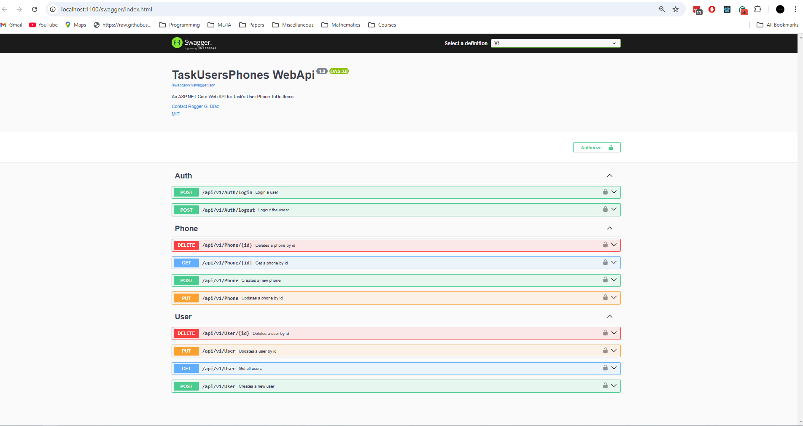
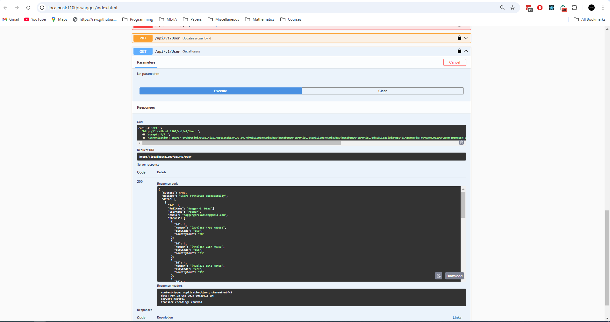
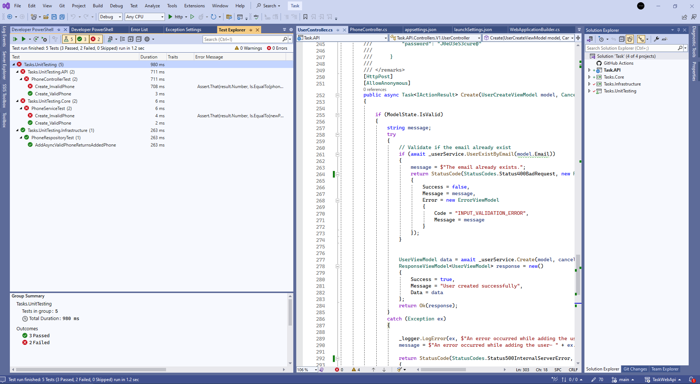

# TaskUsersPhones WebApi

## Swagger API





## Unit Testing



## ASP.NET Core Web API para gestionar teléfonos de usuarios.

# Estructura del proyecto

```
├── src
│   ├── Core                   # Contiene el núcleo de la lógica de negocio y los modelos de dominio, view models, etc.
│   ├── Infrastructure        # Contiene la infraestructura concerniente a los accesos de datos, servicios externos, etc.
│   └── API                   # Contiene la capa de API, incluyendo controles, extensiones, etc.
├── tests
│   ├── Core.Tests              # Contiene las pruebas unitarias de la capa núcleo.
│   ├── Infrastructure.Tests    # Contiene las pruebas unitarias de la capa de infraestructura.
│   └── API.Tests                # Contiene las pruebas unitarias de la capa de API.
└── README.md                   # Documentación del proyecto.
```

# Documentación de la API en Swagger

En este [Link](https://app.swaggerhub.com/apis/ROGGERGARCIADIAZ_1/TaskUserPhonesWebAPI/v1 "Documentación Swagger") se puede acceder la documentación de la API en Swagger.

# Inicializar el proyecto

1. Asegurar tener instalado el .NET 8 SDK en la máquina.
2. Cloner o descargar este repositorio en la máquina.
3. Abrir la solución del proyecto en su IDE de preferencia (recomendable Visual Studio).
4. Contruir la solución del proyecto para restaurar los paquetes de NuGet.
5. Establecer la cadena de conexión en el archivo `appsettings.json` de la infraestructura.

> [!IMPORTANT]  
> Es importante tener en consideración que en el entorno donde se ejecutará la base de datos. Es decir, en esta proyecto se ejecutó en Oracle en Docker y en una instancia local. El la cadena de conexión tiene el siguiente formato:
>
> Data Source=**{SQL_SERVER_HOSTNAME}**;Initial Catalog=**{SQL_SERVER_DATABASE}**;Integrated Security=True;Trust Server Certificate=True;
>
> Los valores `SQL_SERVER_HOSTNAME` y `SQL_SERVER_DATABASE` se deben cambiar los sus respectivos valores.

1. Abrir `Package  Manager Console`, seleccionar el proyecto `Task.Infrastructure`, y ejecutar el comando `Update-Database` para crear la base de datos.
2. Ejecutar la aplicación inicialización el proyecto `Task.API`.

# Características

## Arquitectura CLEAN

La estructura del proyecto está organizada para promover una clara separación de preocupaciones, lo que facilita la comprensión, prueba y mantenimiento de la aplicación. A continuación se muestra un ejemplo de la estructura del proyecto:

```c#
   // Core/Services/PhoneService.cs
   public class PhoneService {
   private readonly IPhoneRepository _phoneRepository;

   public PhoneService(IPhoneRepository phoneRepository) {
     _phoneRepository = phoneRepository;
   }

   public async Task IPhoneService.Delete(int id, CancellationToken cancellationToken) {
     Phone entity = await _phoneRepository.GetById(id, cancellationToken);
     await _phoneRepository.Delete(entity, cancellationToken);
   }
 }
```

## Repository Pattern:

El patrón de repositorio abstrae la capa de acceso a datos y proporciona una interfaz consistente para trabajar con datos. A continuación se muestra un ejemplo de una clase de repositorio en la capa de infraestructura:

```c#
 // Infrastructure/Repositories/PhoneRepository.cs
  public class PhoneRepository: IPhoneRepository {
   private readonly DbContext _dbContext;

   public PhoneRepository(DbContext dbContext) {
     _dbContext = dbContext;
   }

   public async Task < bool > ExistsPhoneById(int id) {
     return await _dbContext.Phones.AnyAsync(x => x.Id == id);
   }
 }
```

## Entity Framework Core

Entity Framework Core se utiliza como herramienta ORM para el acceso a datos. La clase ApplicationDbContext en la capa de Infraestructura representa el contexto de la base de datos:

```c#
// Infrastructure/Data/ApplicationDbContext.cs
  public class ApplicationDbContext : DbContext
  {
      public DbSet<Phone> Phones { get; set; }

      protected override void OnModelCreating(ModelBuilder modelBuilder)
      {
      }
  }
```

## JWT Auth

La autenticación basada en tokens se implementa mediante JSON Web Tokens (JWT) para administrar las sesiones de usuario, la autenticación y la autorización de forma segura. A continuación se muestra un ejemplo de un controlador de autenticación en la capa API:

```c#
   // API/Controllers/AuthenticationController.cs
   public class AuthenticationController : ControllerBase
   {
       private readonly IAuthService _authService;

       public AuthenticationController(IAuthService authService)
       {
           _authService = authService;
       }

       [HttpPost("login")]
       public async Task<IActionResult> Login(LoginRequestModel model)
       {
           var token = await _authService.GenerateToken(model.Username, model.Password);
           return Ok(new { Token = token });
       }
   }
```

## API Versioning

El control de versiones de API se adopta para admitir cambios evolutivos y al mismo tiempo mantener la compatibilidad con versiones anteriores. A continuación se muestra un ejemplo de controladores versionados en la capa API:

```c#
   // API/Controllers/V1/PhoneController.cs
   [ApiController]
   [ApiVersion("1.0")]
   [Route("api/v{version:apiVersion}/phone")]
   public class PhoneController : ControllerBase
   {
   }

   // API/Controllers/V2/PhoneController.cs
   [ApiController]
   [ApiVersion("2.0")]
   [Route("api/v{version:apiVersion}/phone")]
   public class PhoneController : ControllerBase
   {
   }
```

## Dependency Injection:

El contenedor de inyección de dependencias integrado de ASP.NET Core se utiliza para administrar e inyectar dependencias en toda la aplicación. A continuación se muestra un ejemplo de registro de servicio en la clase Startup:

```c#
   // API/Startup.cs
   public void ConfigureServices(IServiceCollection services)
   {
       services.AddScoped<IPhoneService, PhoneService>();
       services.AddScoped<IPhoneRepository, PhoneRepository>();
   }
```

## Unit Testing

Se incluyen proyectos de prueba separados para pruebas unitarias de las capas central, de infraestructura y de API, lo que garantiza la calidad y confiabilidad del código. A continuación se muestra un ejemplo de una prueba unitaria para la clase UserService:

```c#
   // Tests.UnitTesting/Core/PhoneServiceTests.cs
   public class PhoneServiceTests {
   [Test]
   public async Task Create_ValidPhone() {
     PhoneService taskService = new(
       _phoneViewModelMapperMock.Object,
       _phoneCreateMapperMock.Object,
       _phoneUpdateMapperMock.Object,
       _phoneRepositoryMock.Object,
       _userContextMock.Object,
       default,
       default);

     PhoneCreateViewModel newPhoneCreateViewModel = new() {
       Number = "803-234-1305",
         CityCode = "2",
         CountryCode = "+803",
         UserId = 2

     };

     PhoneViewModel newPhoneViewModel = new() {
       Number = "803-234-1305",
         CityCode = "2",
         CountryCode = "+803",

     };

     Phone createdPhone = new() {
       Number = "803-234-1305",
         CityCode = "2",
         CountryCode = "+803",
         UserId = 2

     };

     _ = _phoneCreateMapperMock.Setup(mapper => mapper.MapModel(newPhoneCreateViewModel))
       .Returns(createdPhone);

     _ = _phoneRepositoryMock.Setup(repo => repo.Create(createdPhone, It.IsAny < CancellationToken > ()))
       .ReturnsAsync(createdPhone);

     _ = _phoneViewModelMapperMock.Setup(mapper => mapper.MapModel(createdPhone))
       .Returns(newPhoneViewModel);

     // Act
     PhoneViewModel result = await taskService.Create(newPhoneCreateViewModel, It.IsAny < CancellationToken > ());

     // Assert
     ClassicAssert.NotNull(result);
     ClassicAssert.That(result.Number, Is.EqualTo(newPhoneCreateViewModel.Number));

   }
 }
```
